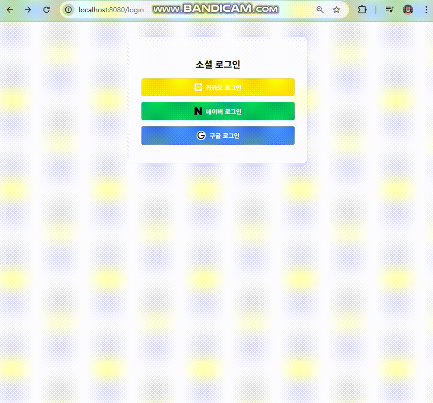

# security-service
Spring Security 기반의 인증 학습 프로젝트로, 세션/JWT 방식의 일반 로그인과 OAuth 2를 활용한 소셜 로그인(네이버, 카카오, 구글)을 구현한다.

### 프로젝트 구조

```
security-service/
├── normal/         # 일반 로그인(세션 기반 또는 JWT 기반 인증)
├── oauth2/         # Ouath2 기반 소셜 로그인
```


## 일반 로그인
일반 로그인 양식으로 2가지 인증 방식을 필요에 따라 지원 가능

### 시연 영상 : [유튜브로 이동](https://youtu.be/-2XIdglsYlg)


### 사용 기술
* Bootstrap 5
* JQuery 3.7.1
* Spring Security 6.4.2
* JPA
* mysql connector
* thymeleaf
	* 정적 리소스로 html을 제공(/resources/static 경로)하면 .html 확장자까지 붙여야 한다.
	* .html 확장자가 붙은 리소스는 Security 엔드포인트 보호 설정에 충돌이 될 수 있다.
	* 그러므로 viewResolver를 사용하여 확장자를 붙이지 않도록 추가한다.

### 지원 인증 방식
* 세션 방식 인증 구현
* JWT 방식 인증 구현

### 지원 기능
* 로그인
	* 일반 사용자는 로그인 이후 바로 인증처리
	* 관리자는 로그인 이후 2차 OTP 인증 필요
* 회원가입
* 로그아웃


## OAuth 2 기반 소셜 로그인
OAuth 2 기반의 소셜 로그인 기능을 제공(OAuth 2 클라이언트)  
인증 이후 JWT 토큰 발급 및 서비스 이용 가능, 로그아웃 기능을 제공하는 간단한 프로젝트  

### 참고 자료
구현 과정에서 직접 정리한 블로그입니다.
* [각 OAuth 제공자 서비스 설정 방법](https://little-pecorino-c28.notion.site/3d41e7960e014a9b83129beb7fd2f3c3)
* [OAuth 2 클라이언트 구현 정리](https://little-pecorino-c28.notion.site/OAuth-2-Github-SSO-16782094ef0a80ceb4c5fb3c1e6a79b6)

### 시연 영상


### OAuth 2 인증 제공자
* 네이버
* 카카오
* 구글

### 사용 기술
* Spring Security 6.4.5
* spring-boot-starter-oauth2-client 6.4.5
* thymeleaf
	* 정적 리소스로 html을 제공(/resources/static 경로)하면 .html 확장자까지 붙여야 한다.
	* .html 확장자가 붙은 리소스는 Security 엔드포인트 보호 설정에 충돌이 될 수 있다.
	* 그러므로 viewResolver를 사용하여 확장자를 붙이지 않도록 추가한다.

## HTML 출처 (무료 템플릿 사이트)
* https://freefrontend.com/bootstrap-code-examples
* https://bootsnipp.com